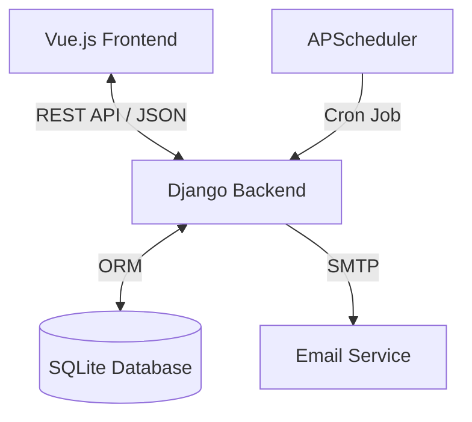

# AssignHub Technical Architecture

## 1. System Overview
AssignHub is a web-based assignment management system designed to help students track courses and deadlines. The system follows a monolithic architecture with a decoupled frontend (SPA) served by the backend.

### Key Components
- **Frontend**: Single Page Application (SPA) using Vue.js 3 (CDN mode) + Tailwind CSS.
- **Backend**: Django + Django REST Framework (DRF) exposing a RESTful API.
- **Database**: SQLite (default) for data persistence.
- **Background Tasks**: APScheduler (integrated via Django management command) for email reminders.

## 2. Architecture Diagram

## 3. Backend Architecture (Django)

### 3.1. Project Structure
- `config/`: Main project configuration (`settings.py`, `urls.py`).
- `api/`: The core application containing business logic.
  - `models.py`: Database schema definitions.
  - `views.py`: API ViewSets and endpoints.
  - `serializers.py`: Data validation and serialization.
  - `management/commands/`: Custom management commands (e.g., `run_reminders`).

### 3.2. Data Models
- **User**: Custom user model extending `AbstractUser`.
- **Course**: Represents a subject/course (One-to-Many with User).
- **Task**: Represents an assignment (One-to-Many with Course and User).
  - Statuses: `todo`, `doing`, `done`.

### 3.3. Authentication
- **Mechanism**: JWT (JSON Web Token) via `djangorestframework-simplejwt`.
- **Flow**:
  1. User registers/logs in → Server returns `access` and `refresh` tokens.
  2. Frontend stores tokens in `localStorage`.
  3. Subsequent requests include `Authorization: Bearer <token>` header.

### 3.4. Background Tasks
- **Library**: `APScheduler` (BlockingScheduler).
- **Implementation**: A custom Django management command (`python manage.py run_reminders`).
- **Schedule**: Runs daily at 8:00 AM to check for tasks due within the next 24 hours.

## 4. Frontend Architecture (Vue.js)

### 4.1. Technology
- **Framework**: Vue.js 3 (Composition API).
- **Styling**: Tailwind CSS (Utility-first).
- **Icons**: Lucide Icons.
- **State Management**: Reactive `ref` and `computed` properties within the main Vue instance.

### 4.2. Key Features
- **Dashboard**: Aggregated view of courses and urgent tasks.
- **Reactivity**: Real-time countdown timers and status updates.
- **Localization**: Full English support.

## 5. Security Measures
- **Password Hashing**: PBKDF2 (Django default).
- **CORS**: Configured via `django-cors-headers` to allow frontend communication.
- **Environment Variables**: Sensitive data (Email credentials, Secret Key) stored in `.env`.

## 6. Deployment
- **Server**: WSGI (e.g., Gunicorn) or simple `runserver` for development.
- **Static Files**: Served by Django's `staticfiles` app.
